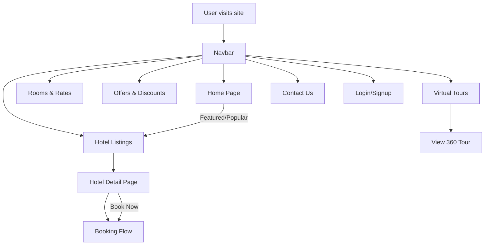

# Project Framework Design Documentation

## Overview
This document describes the architecture, main components, and flow of the Homestaypracticeportal (React + Vite) project.

---

## 1. Project Structure

```
project-root/
├── public/                # Static assets (favicon, redirects, etc.)
├── src/                   # Source code
│   ├── App.jsx            # Main app component
│   ├── App.css            # Global styles
│   ├── main.jsx           # Entry point, router setup
│   ├── components/        # (Optional) Reusable UI components
│   ├── pages/             # (Optional) Page-level components
│   ├── ...                # Feature files (HotelListings, HotelDetailPage, etc.)
│   └── assets/            # Images, icons, etc.
├── package.json           # Project metadata and dependencies
├── vite.config.js         # Vite configuration
├── README.md              # Project overview
└── ...
```

---

## 2. Main Components
- **App.jsx**: Root component, includes Navbar, Footer, and main layout.
- **main.jsx**: Sets up React Router and renders the app.
- **HotelListings.jsx**: Lists all hotels with filters.
- **HotelDetailPage.jsx**: Shows details, gallery, and booking for a hotel.
- **RoomsRates.jsx**: Lists all room types and rates.
- **OffersDiscounts.jsx**: Shows current offers and discounts.
- **VirtualTour.jsx**: Displays virtual tour cards.
- **ViewTour360.jsx**: 360-degree room viewer.
- **ContactUsPage.jsx**: Contact form and info.
- **LoginPage.jsx / SignupPage.jsx**: Authentication forms.
- **App.css**: Global and component styles.

---

## 3. Application Flow Diagram



---

## 4. Data Flow
- **State Management**: Local state (useState/useEffect) for forms, modals, and user session.
- **Routing**: React Router for SPA navigation.
- **Data**: Static JSON/arrays for hotels, rooms, offers, etc. (can be replaced with API calls).
- **Authentication**: LocalStorage mock (can be replaced with real auth).

---

## 5. Extensibility
- Add new pages/components in `src/`
- Replace static data with API integration
- Add Redux or Context for global state if needed
- Add tests in a `__tests__/` folder

---

## 6. Deployment
- Build with `npm run build` (output in `dist/`)
- Deploy `dist/` to Netlify, Vercel, or any static host

---

## 7. Flow Diagram (Visual)

See the Mermaid diagram above for a high-level user and component flow. 